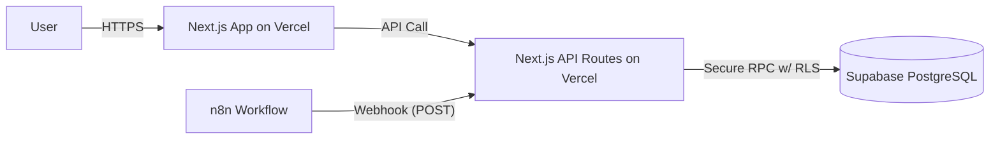

# Competitor Analysis Dashboard - Project Plan (Synchronized)

## 1. Project Overview

Build a high-performance, responsive competitor analysis dashboard. The system will visualize market data, track competitor activities, and provide actionable insights. The core data processing and scoring pipeline is handled exclusively by **n8n**, which feeds final data into our system. The dashboard is a **read-only** analysis tool.

## 2. Tech Stack Selection

This stack is finalized to prioritize development speed, scalability, and a unified full-stack experience, in alignment with the `tech_stack.md` and `PRD.md`.

### Full-Stack Framework
*   **Framework:** **Next.js (App Router)**
*   **Language:** **TypeScript**
*   **Core Principle:** A single, integrated codebase for both frontend and backend API logic, simplifying development and deployment.

### Frontend
*   **Styling:** **Tailwind CSS** + **Shadcn/UI** for rapid, modern UI development.
*   **State Management:**
    *   **TanStack Query (React Query):** For managing all server state and API data fetching.
    *   **Zustand:** For minimal global client state (e.g., UI toggles).
*   **Visualization:** **Recharts** for charts and graphs.

### Backend (Thin BFF)
*   **Framework:** **Next.js API Routes**
*   **Runtime:** **Node.js**
*   **Core Principle:** The backend is a thin "Backend-for-Frontend" (BFF). Its only roles are to proxy authenticated data requests to the database and provide a secure ingestion point for n8n. **No business or scoring logic resides here.**

### Database & Authentication
*   **Platform:** **Supabase**
*   **Database:** **PostgreSQL** (managed by Supabase).
*   **Authentication:** **Supabase Auth** for user management and JWT-based session control.
*   **Security:** **Supabase Row Level Security (RLS)** will be the primary mechanism for enforcing project-based data isolation.

### Deployment
*   **Application:** **Vercel** for hosting the Next.js frontend and backend API routes.
*   **Database/Auth:** **Supabase Cloud**.
*   **ETL Pipeline:** **n8n** (Self-hosted via Docker).

## 3. Architecture

## 4. Key Features (PRD-Aligned)
1.  **Dashboard Overview:** High-level metrics (Total Competitors, Rating Distribution).
2.  **Comparison View:** Side-by-side competitor comparison based on derived scores.
3.  **SWOT Analysis:** Display of data-derived SWOT points.
4.  **Insight & Notes:** Ability for users to add manual insights to competitors.
5.  **Data Ingestion:** Secure endpoint for n8n to push final, scored data.

## 5. Development Roadmap

### Phase 1: Project & Infrastructure Setup
*   Initialize Next.js project with App Router.
*   Set up Supabase project (DB and Auth).
*   Configure Supabase CLI and link project. Define initial database schema from `database.md`.
*   Set up n8n instance.

### Phase 2: Backend & Authentication
*   Integrate **Supabase Auth** with the Next.js frontend.
*   Implement secure, server-side API routes for data access, enforcing RLS.
*   Create the secure ingestion API route for the n8n webhook.

### Phase 3: n8n Integration
*   Design n8n workflow for cleaning, scoring, and formatting data according to the PRD.
*   Configure the n8n HTTP Request node to target the new ingestion API route.
*   Test the end-to-end data flow: Scrape -> n8n -> API -> Supabase DB.

### Phase 4: Frontend Development
*   Build out pages and layouts using the Next.js App Router.
*   Develop reusable UI components with Shadcn/UI and Tailwind CSS.
*   Integrate **TanStack Query** to fetch data from the Next.js API routes.
*   Create dashboard widgets and visualizations with **Recharts**.

### Phase 5: Testing & Deployment
*   Write unit and integration tests for components and API routes.
*   Develop the **E2E test suite** with **Playwright**.
*   Configure CI/CD pipeline on Vercel for automated deployments.
*   Final UAT (User Acceptance Testing).

## 6. Testing Strategy

### Backend (Next.js API Routes)
*   **Framework:** **Jest** or **Vitest** for unit testing API route handlers.
*   **Mocking:** The Supabase client will be mocked to test API logic in isolation.

### Frontend (Next.js Components)
*   **Framework:** **Jest** or **Vitest** with **React Testing Library**.
*   **Focus:** Test components based on user behavior and interaction.

### End-to-End (E2E) Testing
*   **Framework:** **Playwright** for cross-browser tests simulating full user journeys.
